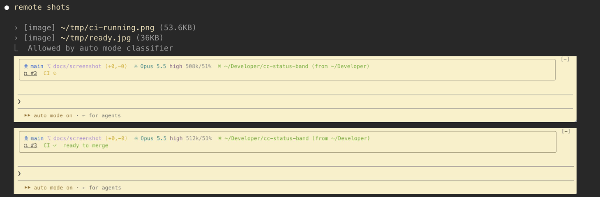

# Inline Images

Images inline in the Claude Code transcript, drawn by your terminal with kitty
graphics. Screenshots Claude takes and sends you show up right under the message
instead of as a path to copy and open somewhere else. It works the same in a
session on a remote server over ssh, with nothing copied back to your machine.



## What it draws

| Where | How |
|---|---|
| Files Claude sends you (`SendUserFile`, attachments of `SendUserMessage`) | inline, under the `› [image]` lines |
| Images Claude reads with `Read` | inline, under the read |
| Images you paste (`[Image #N]`) | inline, under your message |
| Image paths in Claude's replies, your prompts and shell output, when the file exists | a `▸ path` line; click it to unfold the image, click again to fold it |
| A path handed to the session from outside (see [Hotkeys](#hotkeys-and-scripts)) | a pane beside the transcript |

PNG is drawn as is. JPEG and GIF (first frame) are decoded by a small bundled
decoder and scaled to fit, so a server needs no image tools. WebP shows a line
saying it is not drawn.

## Why it works over ssh

The plugin runs inside Claude Code, which is on the server in a remote session. It
reads the image file there and hands the bytes to the terminal inside the normal
output stream. Your terminal decodes and paints them. Nothing is copied with `scp`,
and any server with the plugin installed works the same way.

## Requirements

* Claude Code 2.1.289 or later, with function-hook mods available to your account
* A terminal with the kitty graphics protocol and its Unicode placeholders: kitty,
  Ghostty, and terminals built on them (agterm). Elsewhere each image shows as a
  one-line description instead.
* The fullscreen renderer (`/tui fullscreen`) for clicking `▸` lines open

## Install

```
/plugin marketplace add nnemirovsky/cc-inline-images
/plugin install inline-images@inline-images
```

Install it on every machine Claude Code runs on, including servers you ssh into.

## Hotkeys and scripts

The plugin watches an inbox file for its session and opens a pane with the image
whose path appears there. A hotkey can use that to show the image under the cursor
or in the selection, from the machine where the session runs:

```sh
# Local session: name the file after the terminal pane, if your terminal exports one
printf '%s' "$path" > ~/.cache/inline-images/inbox/"$AGTERM_SESSION_ID"

# Any session, local or remote: name it after the Claude Code session id
ssh server "mkdir -p ~/.cache/inline-images/inbox && cat > ~/.cache/inline-images/inbox/$session_id" <<<"$path"
```

The plugin checks once a second and empties the file when it takes the request, so
a file still holding the path after a couple of seconds means no session took it.
Relative paths resolve against the session's working directory.

## Limits

* At most 2 MiB per image after decoding. Larger PNGs show a line saying so; JPEG and
  GIF are scaled down to fit.
* Inline images are sized to about 100 columns and 24 rows, keeping their aspect
  ratio. The hotkey pane fits the image to the pane.
* Pasted images are looked up in the conversation by their `[Image #N]` marks.
* Background sessions (`claude --bg`) show nothing extra. You view them through
  `claude attach`, which draws an image as its description only, so the plugin
  leaves those sessions alone and does not take hotkey requests there.

## Development

```
claude plugin validate .
claude plugin test .
claude --plugin-dir .
```

## License

MIT. Bundles [jpeg-js](https://github.com/jpeg-js/jpeg-js) (BSD-3-Clause, with
Apache-2.0 parts) and [omggif](https://github.com/deanm/omggif) (MIT); their licenses
are in `hooks/vendor/`.
